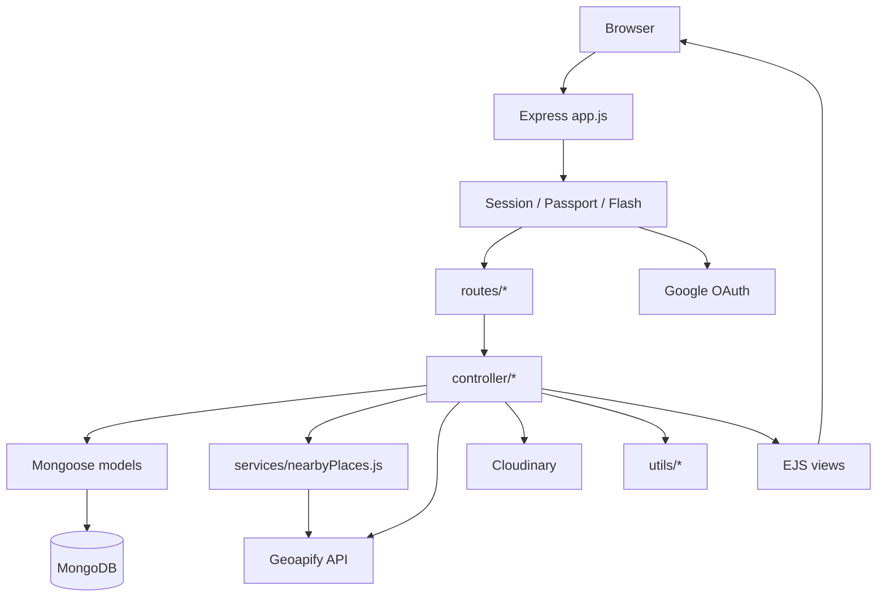
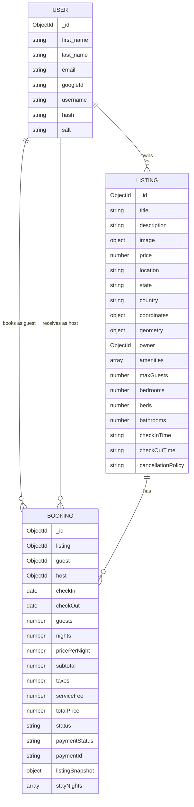
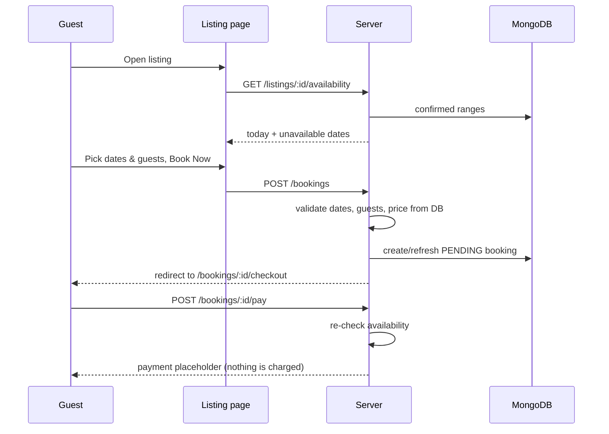

# 🏛️ Atithi — Stay in India. Experience India.

> *"अतिथि देवो भव:"* — the guest is akin to God.

**Atithi** is a server-rendered travel-accommodation marketplace focused on India. Hosts list havelis, homestays, houseboats, desert camps and hill retreats; guests browse by state, pin-point stays on a map, discover nearby food and attractions, pick dates on a live availability calendar, and move through a booking and checkout flow.

Built with **Node.js, Express 5, MongoDB (Mongoose 9), EJS, Passport and Cloudinary**, with **Geoapify** powering maps, reverse geocoding and nearby places.

---

## Table of Contents

1. [Features](#-features)
2. [Tech Stack](#-tech-stack)
3. [Architecture](#-architecture)
4. [Project Structure](#-project-structure)
5. [Getting Started](#-getting-started)
6. [Environment Variables](#-environment-variables)
7. [Seeding Sample Data](#-seeding-sample-data)
8. [Route Reference](#-route-reference)
9. [Data Models](#-data-models)
10. [Booking System](#-booking-system)
11. [Nearby Places](#-nearby-places)
12. [Known Issues & Security Notes](#-known-issues--security-notes)
13. [Roadmap](#-roadmap)

---

## ✨ Features

### Accounts & Auth
- Sign up / log in with **username + password** (Passport Local, hashing via `passport-local-mongoose`)
- **Sign in with Google** (Passport Google OAuth 2.0). Existing accounts are linked by email; new Google users are created automatically
- Session-based login with flash messages
- After login/signup, the user is returned to the page they originally requested (including a pending "Book Now" selection)

### Listings
- Create, view, edit and delete listings
- Cover image upload via **Multer → Cloudinary** (png / jpg / jpeg)
- **Interactive map picker** (Leaflet + Geoapify): the host pins the exact location; the server **reverse-geocodes** it to a verified address and stores both coordinates and GeoJSON (`2dsphere` index)
- Optional property details: max guests, bedrooms, beds, bathrooms, check-in / check-out times, cancellation policy (Flexible / Moderate / Strict)
- **29 amenities** in 5 groups (Essentials, Comfort, Outdoor, Guests & access, Safety) with Font Awesome icons and a "Show all" expander
- "My Listings" page for hosts
- **Explore India by State** — state picker and per-state listing pages, generated dynamically from the data

### Discovery
- Landing page with regional culture, festivals, food and traditional-stay sections
- **Nearby Popular Places** on every listing: food & dining within 10 km, attractions within 25 km (Geoapify Places API, cached, fail-safe)
- One-click **Get Directions** (Google Maps)

### Booking
- Reservation card with a custom **availability calendar** (booked dates are struck through)
- Date range, guest count and pricing validated on both client and server
- Server-calculated pricing: nights × price + taxes + service fee (integer-paise arithmetic)
- Checkout → payment-placeholder flow (**payment gateway not yet connected**)
- "My Bookings" (guest) and "Host Bookings" views, grouped into Upcoming / Pending / Past / Cancelled
- **Double-booking protection** enforced by MongoDB itself (partial unique index on booked nights)

### UI
- Responsive Bootstrap 5 layout with custom styling
- **Dark / light theme** toggle (persisted, no flash on load)

---

## 🧰 Tech Stack

| Layer | Technology |
|---|---|
| Runtime | Node.js |
| Server | Express 5 |
| Database | MongoDB + Mongoose 9 |
| Views | EJS + EJS-Mate (layouts) |
| Auth | Passport, `passport-local`, `passport-local-mongoose`, `passport-google-oauth20` |
| Sessions / UX | `express-session`, `connect-flash`, `method-override` |
| Uploads | Multer, `multer-storage-cloudinary`, Cloudinary |
| Maps & places | Leaflet, Geoapify (reverse geocoding + Places API) |
| Frontend | Bootstrap 5.0.2, Font Awesome 7, Google Fonts (Inter, Playfair Display), vanilla JS |
| Config | dotenv |
| Dev | nodemon |

---

## 🏗 Architecture

Classic MVC on Express — **not** a SPA, and there is currently no JSON API (apart from two small JSON endpoints used by the browser: availability and reverse geocoding).



**Design principles visible in the code**

- Controllers wrap async handlers with `WrapAsync` so rejected promises reach the error middleware.
- The server is the single source of truth for price, nights, totals and availability; the browser's values are never trusted.
- Booking data lives in its own collection; availability is derived from confirmed bookings rather than stored on the listing.
- New listing fields are all optional, so older listings keep working with no migration.
- Nearby-places failures never break the listing page.

---

## 📁 Project Structure

```text
atithi/
├── app.js                      # Entry point: middleware, Passport (local + Google), routes, error handling
├── cloud_config.js             # Cloudinary + Multer storage (folder: travel_exp)
├── middleware.js               # isLogin, save_url
├── package.json
├── .env                        # NOT committed — see Environment Variables
│
├── controller/
│   ├── listing.js              # Listing CRUD, host listings, reverse geocoding, state pages
│   ├── booking.js              # Availability, create booking, checkout, pay (placeholder), booking lists
│   ├── user.js                 # Signup / login handlers
│   └── home.js                 # Homepage controller (currently not wired in — see Known Issues)
│
├── models/
│   ├── user.js
│   ├── listing.js
│   └── booking.js
│
├── routes/
│   ├── listings.js             # /listings/*
│   ├── bookings.js             # /bookings/*, /host/bookings
│   └── users.js                # /signup, /login, /logout, /auth/google*
│
├── services/
│   └── nearbyPlaces.js         # Geoapify Places integration, cache, ranking
│
├── utils/
│   ├── ExpressError.js
│   ├── WrapAsync.js
│   ├── booking.js              # Dates, guests, pricing, double-booking helpers, view formatters
│   └── listingExtras.js        # Amenities, cancellation policies, form whitelisting
│
├── init/
│   ├── data.js                 # 32 sample listings across 8 states
│   └── index.js                # Seed script (destructive!)
│
├── public/
│   ├── css/                    # style.css, booking.css, home.css
│   ├── js/                     # script.js, theme.js, geoapify.js, reservation.js
│   └── images/                 # Landing-page imagery
│
└── views/
    ├── home.ejs
    ├── layouts/boilerplate.ejs
    ├── includes/               # navbar, footer, flash_msg, listing_extras, booking_summary, booking_row
    ├── listing/                # index, show, new, update_page, host_listing, states, state, error
    ├── bookings/               # index, host, show, checkout, payment_placeholder
    └── user/                   # login, signup
```

---

## 🚀 Getting Started

### Prerequisites

- **Node.js** 18+ (the code uses the built-in `fetch`)
- **MongoDB** running locally on `mongodb://127.0.0.1:27017`
- A **Cloudinary** account (image uploads)
- A **Geoapify** API key (maps, geocoding, nearby places)
- *(Optional)* A **Google Cloud OAuth client** for Google sign-in

### Installation

```bash
git clone <your-repo-url> atithi
cd atithi
npm install
```

Create a `.env` file in the project root (see below), then start MongoDB and run:

```bash
npx nodemon app.js
# or
node app.js
```

Open **http://localhost:8080**.

> The MongoDB URI (`mongodb://127.0.0.1:27017/listing`), the port (`8080`) and the session secret are currently hard-coded in `app.js`. See [Known Issues](#-known-issues--security-notes).

---

## 🔐 Environment Variables

Create a `.env` file (never commit it, never ship it in a ZIP):

```env
# Cloudinary
CLOUD_NAME=your_cloud_name
CLOUD_API_KEY=your_api_key
CLOUD_API_SECRET=your_api_secret

# Geoapify (map, reverse geocoding, nearby places)
GEOAPIFY_API_KEY=your_geoapify_key

# Google OAuth (optional — required only for "Sign in with Google")
GOOGLE_CLIENT_ID=your_client_id
GOOGLE_CLIENT_SECRET=your_client_secret
GOOGLE_CALLBACK_URL=http://localhost:8080/auth/google/callback

# Booking pricing (fractions, 0.12 = 12%). Defaults shown.
TAX_RATE=0.12
SERVICE_FEE_RATE=0.06

# Nearby places tuning (optional). Defaults shown.
NEARBY_FOOD_RADIUS_METERS=10000
NEARBY_TRAVEL_RADIUS_METERS=25000
NEARBY_FOOD_LIMIT=8
NEARBY_TRAVEL_LIMIT=8
NEARBY_CACHE_TTL_MS=21600000
NEARBY_REQUEST_TIMEOUT_MS=8000
```

| Variable | Required | Used by |
|---|---|---|
| `CLOUD_NAME`, `CLOUD_API_KEY`, `CLOUD_API_SECRET` | Yes | `cloud_config.js` |
| `GEOAPIFY_API_KEY` | Yes | map page, `controller/listing.js`, `services/nearbyPlaces.js` |
| `GOOGLE_CLIENT_ID`, `GOOGLE_CLIENT_SECRET`, `GOOGLE_CALLBACK_URL` | For Google login | `app.js` |
| `TAX_RATE`, `SERVICE_FEE_RATE` | No | `utils/booking.js` |
| `NEARBY_*` | No | `services/nearbyPlaces.js` |

> ⚠️ `TAX_RATE` and `SERVICE_FEE_RATE` are application-level configuration, not legal tax advice. Real GST depends on tariff slabs and property type — check with an accountant before charging real money.

---

## 🌱 Seeding Sample Data

`init/data.js` contains **32 sample stays** (4 each for Kerala, Maharashtra, Goa, Gujarat, Rajasthan, Jammu & Kashmir, Chhattisgarh and Andhra Pradesh) with coordinates and GeoJSON.

```bash
node init/index.js
```

> ⚠️ **Destructive:** this runs `listing.deleteMany({})`. Never run it against real data.
>
> Before running, replace the hard-coded `owner` ObjectId in `init/index.js` with the `_id` of a real user in your database (sign up first, then copy the id from MongoDB).

---

## 🗺 Route Reference

### Public pages & listings

| Method | Path | Auth | Description |
|---|---|---|---|
| GET | `/` | – | Landing page |
| GET | `/listings` | – | All listings |
| GET | `/listings/states` | – | Choose a state |
| GET | `/listings/state/:state` | – | Listings in a state |
| GET | `/listings/:id` | – | Listing detail, reservation card, nearby places |
| GET | `/listings/:id/availability` | – | JSON: booked date ranges (dates only) |

### Listing management

| Method | Path | Auth | Description |
|---|---|---|---|
| GET | `/listings/new` | ✅ | New-listing form with map |
| POST | `/listings` | ⚠️ none | Create listing (multipart) |
| GET | `/listings/host` | ⚠️ none | My listings |
| GET | `/listings/reverse-geocode` | ✅ | JSON reverse geocoding |
| GET | `/listings/:id/edit` | ✅ | Edit form |
| PUT | `/listings/:id` | ✅ | Update listing |
| DELETE | `/listings/:id` | ✅ | Delete listing |
| GET | `/listings/:id/book` | ✅ | Resume a booking selection after login |

### Bookings

| Method | Path | Auth | Description |
|---|---|---|---|
| GET | `/bookings` | ✅ | My bookings |
| POST | `/bookings` | ✅ | Create / refresh a pending booking |
| GET | `/bookings/:id` | ✅ guest or host | Booking details |
| GET | `/bookings/:id/checkout` | ✅ guest | Checkout page |
| POST | `/bookings/:id/pay` | ✅ guest | Re-validates, then redirects to placeholder |
| GET | `/bookings/:id/payment-placeholder` | ✅ guest | Temporary payment page |
| GET | `/host/bookings` | ✅ | Bookings on my listings |

### Auth

| Method | Path | Description |
|---|---|---|
| GET / POST | `/signup` | Register |
| GET / POST | `/login` | Log in |
| GET | `/logout` | Log out |
| GET | `/auth/google` | Start Google OAuth |
| GET | `/auth/google/callback` | Google OAuth callback |

> ⚠️ In `routes/listings.js`, `/listings/states`, `/listings/state/:state` and the other fixed paths must stay registered **before** `/:id`, or they will be swallowed by the param route.

---

## 🗄 Data Models



**Notes**

- `Listing` requires `title`, `state` and `coordinates`; `geometry` is a GeoJSON `Point` with a `2dsphere` index.
- `Booking.listingSnapshot` stores the title, image, location, state, times and cancellation policy at booking time, so history survives later edits or deletion of the listing.
- Booking `status`: `pending | confirmed | cancelled | completed`. `paymentStatus`: `pending | paid | failed | refunded`.

---

## 📅 Booking System

### Flow



### Rules

- A stay is the half-open interval `[checkIn, checkOut)` — a new guest may check in on the previous guest's check-out day.
- Dates are stored as UTC midnight; "today" is determined in `Asia/Kolkata`.
- Maximum stay: **30 nights**. Default max guests when unset: **4**.
- Only **confirmed** bookings block dates. Pending and cancelled bookings do not.
- Hosts cannot book their own listings.
- Repeated clicks on "Book Now" refresh the same pending booking instead of creating duplicates.
- Pricing is computed in integer paise: `subtotal = price × nights`, then tax and service fee are added.

### Double-booking guard

Each booking stores `stayNights` (e.g. `["2026-10-08", "2026-10-09"]`). A **unique partial index** on `{ listing, stayNights }` covering only `status: "confirmed"` makes MongoDB refuse overlapping confirmed bookings, even when two requests race. A friendly pre-save check provides a readable error first; `isDoubleBookingError(err)` detects both cases.

### Connecting a payment gateway (e.g. Razorpay)

`controller/booking.js → pay_booking` contains a clearly marked integration point. The intended steps:

1. Create a gateway order for `booking.amountInPaise` (store the order id on the booking).
2. Open the gateway checkout in the browser.
3. Add a new route (e.g. `POST /bookings/:id/verify`) for the callback.
4. Verify the signature server-side and check the amount matches.
5. Only then set `paymentStatus = "paid"`, `paymentId`, `status = "confirmed"`, and `save()`.
6. If saving throws a double-booking error after money was taken, **refund the payment**.

Once a booking is confirmed, its dates appear in `/listings/:id/availability` automatically. Delete `payment_placeholder` (route, controller, view) afterwards.

---

## 📍 Nearby Places

`services/nearbyPlaces.js` queries the **Geoapify Places API** around a listing's coordinates:

- **Food & dining:** category `catering`, 10 km radius
- **Places to visit:** tourism, museums, zoos, aquariums, theme parks, culture, parks, natural, beaches, heritage, places of worship — 25 km radius
- Results are radius-checked, de-duplicated, ranked (proximity + category relevance) and trimmed
- Distances are computed locally with the Haversine formula
- Results are cached in memory (6 h by default)
- The function **never rejects**: on a missing key, invalid coordinates or API error it returns empty lists and the page renders normally

Geoapify's Places endpoint returns no ratings or popularity data, so those fields are always `null` and the ⭐ / 🔥 badges never appear for Geoapify-sourced places (by design — nothing is fabricated).

---

## 🤝 Contributing

1. Fork the repo and create a feature branch.
2. Keep to the existing Express + EJS + Mongoose + Passport architecture unless a migration is discussed first.
3. **Never trust UI-only authorization** — enforce it on the server.
4. Never commit secrets.
5. Open a pull request describing which files changed and why.


---
